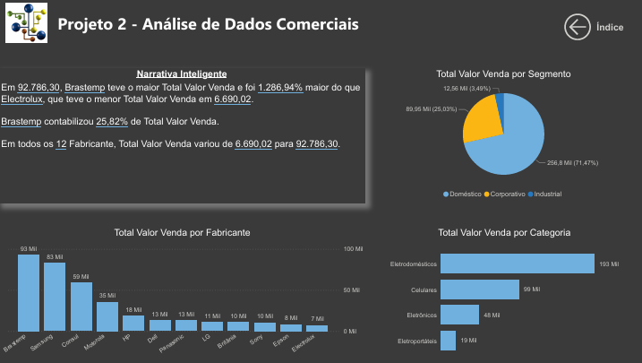
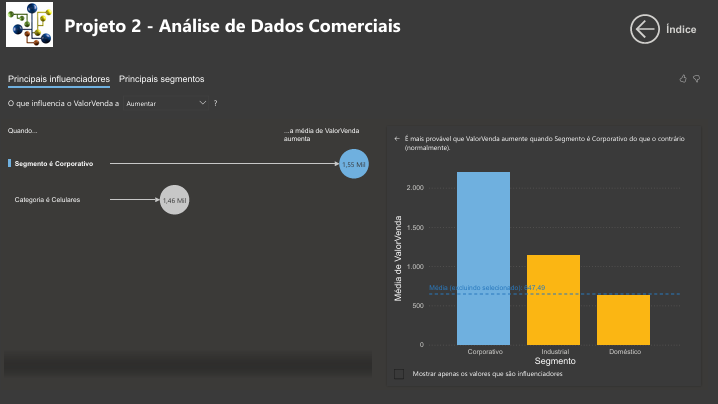
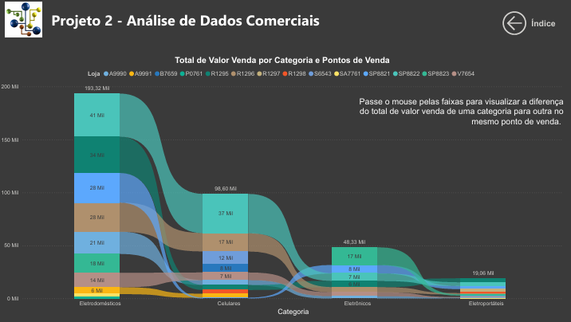
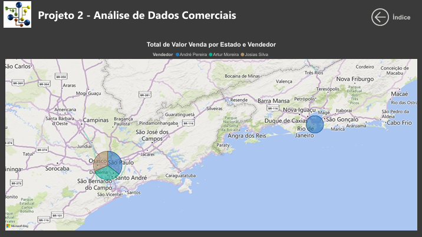
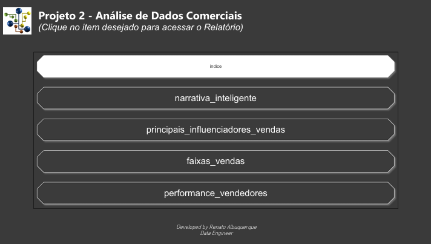

# Projeto 2 - Análise de Dados Comerciais
Projeto do curso: "Microsoft Power BI Para Business Intelligence e Data Science", por [Data Science Academy](www.datascienceacademy.com.br). 

## Sobre o Dataset
O dataset “Análise de Dados Comerciais” contém 457 registros de vendas e está estruturado em uma única planilha chamada “Vendas”, com 14 colunas que reúnem informações detalhadas sobre produtos, vendedores, clientes e resultados financeiros.  

### Estrutura do dataset:
- ID-Produto / Produto → Identificação única e nome do item vendido.
- Categoria → Tipo de produto (ex.: Celulares, Eletrodomésticos).
- Segmento → Público-alvo (ex.: Corporativo, Doméstico).
- Fabricante → Marca responsável pelo produto.
- Colunas: Loja / Cidade / Estado → Localização da venda.
- Colunas: Vendedor / ID-Vendedor → Nome e código do responsável pela venda.
- Comissão (Percentual) → Percentual de comissão aplicado ao vendedor.
- Data Venda → Data em que a venda foi realizada (entre 2012 e anos seguintes).
- ValorVenda → Receita obtida na transação.
- Custo → Valor de custo do produto.

## Perspectivas para análises
Os dashboards apresentados abaixo mostram um fluxo analítico que vai da visão macro (fabricantes e segmentos) até a performance detalhada por vendedores e regiões. Seguem elaboração de insights para tomada de decisão assertiva dos gestores do negócio.

### Narrativa Inteligente
- Destaque para o desempenho por fabricante.
- A Brastemp obteve o maior valor total de vendas (≈ R$ 92,8 mil), representando 25,82% do total, e superando a Electrolux (≈ R$ 6,7 mil), que teve o menor resultado.
- O painel mostra a variação de vendas entre os 12 fabricantes, reforçando a liderança de alguns players no mercado.

### Dataviz - Narrativa Inteligente

 

### Principais Influenciadores
- Análise de fatores que mais impactam o Valor das Vendas.
- Observa-se que as vendas tendem a ser maiores no segmento Corporativo, seguido pela categoria Celulares.
- O relatório evidencia padrões: quando o segmento é corporativo, a média de vendas aumenta significativamente em relação ao doméstico.

### Dataviz - Principais Influenciadores Vendas

 

### Faixas de Vendas
- Comparação do total de vendas por categoria e ponto de venda (loja).
- Principais destaques em valor total:
- Eletrodomésticos (≈ R$ 193 mil),
- Celulares (≈ R$ 98,6 mil),
- Eletrônicos (≈ R$ 48,3 mil).
- É possível explorar, loja a loja, quais categorias se destacam mais em volume de vendas.

### Dataviz - Faixas Vendas

 

### Performance de Vendedores
- Apresenta as vendas distribuídas por estado e vendedor.
- O painel facilita a análise geográfica e individual de performance, permitindo identificar quais vendedores se destacam em cada região.
- Entre os destaques estão nomes como André Pereira, Artur Moreira e Josias Silva.

### Dataviz - Performance Vendedores

 

### Dataviz - Índice

 

## Dashboard Online
[Ver Dashboard online.](https://app.powerbi.com/view?r=eyJrIjoiZTgyODM2MDUtOTE3OC00NDA4LTgzNTYtZWU0NjhjZGIxN2VkIiwidCI6IjY1OWNlMmI4LTA3MTQtNDE5OC04YzM4LWRjOWI2MGFhYmI1NyJ9)
 

[End]

